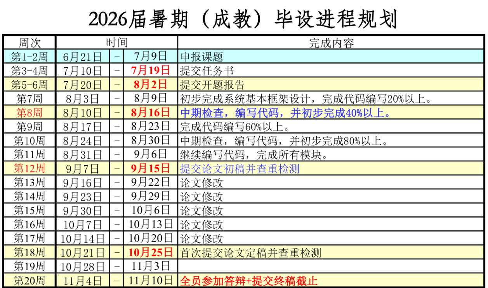

# 毕业设计（论文）任务书

## 封面信息

- 学院：上海大学继续教育学院
- 文档：毕业设计（论文）任务书
- 指导教师：__________
- 课题名称：基于 Flutter 与 Python 的跨平台数字笔记系统的设计与实现
- 作业期限：____ 年 __ 月 __ 日起至 ____ 年 __ 月 __ 日止
- 学号：__________
- 姓名：__________
- 专业班级：__________
- 层次：__________
- 课题来源：自拟
- 日期：____ 年 __ 月 __ 日

## （一）课题来源、意义与主要内容

### 课题来源

本课题为自拟课题。课题依托个人毕业设计项目 InkNest Notes，面向移动端学习、办公和资料整理场景，设计并实现一套基于 Flutter 与 Python 的跨平台数字笔记系统。系统以 Flutter 客户端为主要交互入口，完成本地笔记、手写编辑、PDF 批注、富内容编辑和导出闭环；Python 模块面向服务接口、检索索引、识别处理、同步支持和数据处理等扩展能力进行设计。

### 课题意义

随着平板电脑、触控屏和手写笔设备的普及，学生、教师和办公用户越来越多地将课堂讲义、论文资料、会议材料和个人知识整理迁移到数字环境中。近年的高校记笔记研究比较了手写、键盘、平板和专用应用等方式，表明记录媒介、认知负荷和学习动机会共同影响信息加工、知识保持与使用策略[1-3]。传统纸质笔记书写自然，但在检索、备份、跨设备使用和资料复用方面存在不足；普通在线文档便于编辑和协作，但难以完整承载手写推导、图形标注和 PDF 阅读批注等学习场景。Goodnotes、Notability、OneNote 等产品的发展说明，手写笔记、PDF 批注、音频回放、搜索、跨端同步和知识库组织已经成为数字笔记系统的重要方向。

移动学习研究表明，感知有用性、易用性和使用环境会影响移动学习工具的采用[4]；Flutter 相关研究说明，Flutter 与 Dart 能够以单一代码库支持移动端、Web 和桌面端应用开发[5]；手写文本识别研究则为后续 OCR 和手写内容检索提供了可行的技术方向[6]。因此，本课题以跨平台数字笔记系统为研究对象，前端选择 Flutter 实现移动端手写与文档交互，Python 模块计划承担服务接口、数据处理、检索索引和同步支持等扩展职责。课题具有明确的工程实践价值：一方面完成“创建笔记本、自然书写、可靠保存、导入批注 PDF、导出学习资料”的核心流程；另一方面通过本地优先的数据模型、清晰的文件存储结构和可扩展的模块边界，使系统形成可演示、可测试、可验收的前端闭环，并具备进一步接入 Python 服务、跨设备同步、移动端快速捕获和 Web 知识库的扩展基础。

### 主要内容

本课题主要完成以下内容：

1. 需求分析与总体设计：分析手写笔记、PDF 批注和资料整理场景，确定 InkNest Notes 的功能边界、数据模型、模块划分和 Flutter/Python 技术路线。
2. 笔记库模块：实现笔记本创建、打开、重命名、复制、归档、删除、文件夹管理、搜索、排序、最近笔记和缩略图预览。
3. 手写编辑模块：实现分页画布、触控书写、画笔、荧光笔、橡皮擦、颜色和线宽设置、撤销/重做、缩放平移、手指拖动画布和 Apple Pencil 优先的交互模式。
4. 页面与元素管理：实现多页笔记、页面新增、复制、删除、排序、插入空白页、文本框、手写风格文本、图片插入、形状工具和常用笔预设工具栏。
5. PDF 学习流程：实现 PDF 导入、PDF 页面背景渲染、PDF 页面缩略图、目录、书签、范围导出和带批注 PDF 导出。
6. Python 扩展设计：明确 Python 模块与 Flutter 前端的边界，规划服务接口、数据处理、搜索索引、OCR/手写识别或同步备份等方向；已纳入实现范围的模块提供具体实现和测试，其余能力作为扩展方案说明。
7. 智能与检索扩展：以 Smart Ink 初版、PDF 文本搜索和音频记录为增强方向；已纳入实现范围的功能进入演示和论文实现章节，真实手写识别、OCR、音频转写和云同步等高级能力作为展望说明。
8. 测试与总结：编写模型、存储、导出和关键交互测试，整理毕业论文、演示材料和后续优化方向。

### 课题范围

为避免课题范围过大，毕业设计范围划分如下：

- 必须完成并作为主要验收内容：Flutter 前端应用、笔记库、手写编辑、多页管理、本地存储、PDF 导入批注、PDF 导出、文本/图片/图形等富内容编辑和基础测试。
- 增强内容：音频录制、PDF 文本搜索、Smart Ink 进一步优化等功能，作为系统增强能力纳入实现或扩展设计。
- 扩展设计与展望内容：Python 服务接口、OCR、真实手写识别、音频转写、云同步、Web 知识库和 AI 辅助学习等方向，用于体现系统的可扩展性和后续研究价值。

## （二）目的、要求和主要技术指标

### 目的

本课题目标是设计并实现一套基于 Flutter 与 Python 的跨平台数字笔记系统。系统以 Flutter 客户端为实现主体，使用户能够在移动设备上创建本地笔记本、进行手写记录、导入并批注 PDF、管理多页内容、插入文本图片图形并导出带批注的 PDF 文件；同时完成 Python 扩展模块设计，为服务接口、检索、识别、同步或数据处理能力预留接入空间。

### 基本要求

- 系统应以笔记库为入口，支持笔记本与文件夹的基本管理。
- 编辑器应支持分页笔记模型，而不是无限画布，以便匹配 PDF、导出和学习资料整理场景。
- 手写画布应支持低延迟书写、基础工具切换、撤销/重做和可靠保存。
- PDF 导入后应能够逐页作为背景进行批注，批注内容应保持可编辑。
- 导出的 PDF 应包含空白页、PDF 背景、手写笔迹、文本、图片和图形等内容。
- 数据应优先本地保存，存储格式应便于检查、迁移和同步扩展。
- 系统应具有清晰的模块结构，便于论文阐述和功能扩展。

### 功能指标

- 笔记库功能：创建、打开、重命名、复制、归档、恢复、删除笔记本；创建文件夹并移动笔记本；支持搜索、排序、最近笔记和缩略图。
- 书写功能：支持画笔、荧光笔、橡皮擦、颜色、线宽、撤销/重做、平滑笔迹、局部擦除、缩放和平移。
- 页面功能：支持多页笔记、页面新增、复制、删除、排序和在 PDF 页面之间插入空白页。
- PDF 功能：支持导入 PDF、按页渲染背景、显示 PDF 缩略图、读取目录、添加书签、按全本/当前页/连续页范围导出 PDF。
- 富内容功能：支持文本框、手写风格文本、图片插入、图形绘制和常用笔预设。
- 智能辅助功能：支持 Smart Ink 初版流程，即框选粗略手写、确认文字并生成可编辑的手写风格文本；真实手写识别、OCR 和全文搜索作为扩展方向。
- 学习辅助功能：音频录制、录音播放时间线与书写笔迹关联作为增强能力，根据实现范围纳入验收或扩展说明。
- Python 扩展功能：形成 Python 模块职责说明，明确可承担的接口服务、数据处理、检索索引、识别处理或同步备份方向，并按实现情况提供接口说明、运行方式或扩展设计。

### 可验收指标

- 应能在 Flutter 支持的目标平台运行，进入应用后默认显示笔记库页面。
- 应能创建至少一个笔记本，进入编辑器后完成书写、翻页、保存和重新打开恢复。
- 应能导入 PDF 并生成对应笔记页面，用户可在 PDF 页面上书写或插入内容。
- 应能导出包含页面背景、笔迹、文本、图片和图形的 PDF 文件，并支持全本、当前页或连续页范围导出。
- 应能通过自动化测试覆盖核心模型、文件仓储、笔迹几何和 PDF 导出逻辑。
- 应能提供典型演示流程：创建笔记本、书写、插入文本/图片/图形、导入 PDF、添加批注、导出 PDF、关闭后重新打开恢复内容。
- 文档应说明 Python 模块的职责边界、接口方案、运行方式和测试安排；已实现模块提供基础测试记录，扩展模块提供设计说明。

### 非功能指标

- 可用性：界面优先适配 iPad 横屏和触控使用，常用工具应容易触达，手指平移与手写输入不应冲突。
- 可靠性：笔记本元数据和页面内容以 JSON 文件保存；文件写入采用临时文件替换和页面保存串行化，降低高频编辑时的数据损坏风险。
- 性能：PDF 背景渲染应避免重复打开文档和重复渲染，导出时缓存相同背景；普通笔记页面书写、缩放和缩略图显示应保持流畅。
- 可维护性：代码按应用层、功能模块层、模型层、存储层和导出层组织，使用仓储层隔离界面逻辑与存储实现。
- 可扩展性：数据模型预留文本、图片、图形、Smart Ink、音频、搜索、同步和 Web 知识库等扩展点；Python 模块接入时，应补充前后端接口、数据交换格式、服务部署说明和异常处理策略。
- 可测试性：模型、文件仓储、笔迹几何、PDF 导出等核心模块应具有自动化测试或手工测试记录。

### 预期成果

- 一套可运行的 Flutter 数字笔记前端应用原型。
- 一套本地笔记数据模型与文件存储方案。
- 一套 PDF 导入、批注和导出流程。
- 一份 Python 扩展模块设计说明，包含职责边界、接口方向和接入方案；如已实现配套模块，则补充运行和测试记录。
- 毕业论文、任务书、开题报告、演示材料和测试记录。

## （三）进度计划

进度依据：2026届暑期（成教）毕设进程规划。

| 周次 | 时间 | 学院要求 | 本课题对应工作与阶段成果 |
| --- | --- | --- | --- |
| 第 1-2 周 | 6 月 21 日 - 7 月 9 日 | 申报课题 | 确定课题名称、研究方向和系统总体范围，梳理 Flutter 前端与 Python 扩展边界。 |
| 第 3-4 周 | 7 月 10 日 - 7 月 19 日 | 提交任务书 | 完成任务书，明确课题来源、主要内容、技术指标、进度计划和参考文献。 |
| 第 5-6 周 | 7 月 20 日 - 8 月 2 日 | 提交开题报告 | 完成开题报告，补充选题意义、国内外发展状况、技术路线、风险应对和论文提纲。 |
| 第 7 周 | 8 月 3 日 - 8 月 9 日 | 初步完成系统基本框架设计，完成代码编写 20% 以上。 | 搭建 Flutter 项目结构、应用主题、笔记库入口、核心模型和本地仓储框架。 |
| 第 8 周 | 8 月 10 日 - 8 月 16 日 | 中期检查，编写代码，并初步完成 40% 以上。 | 完成阶段性中期材料，推进手写画布、工具栏、撤销/重做、多页笔记和基础保存能力。 |
| 第 9 周 | 8 月 17 日 - 8 月 23 日 | 完成代码编写 60% 以上。 | 完成 PDF 导入、页面背景渲染、批注保存、页面管理和文件夹/搜索/排序等资料管理功能。 |
| 第 10 周 | 8 月 24 日 - 8 月 30 日 | 中期检查，编写代码，并初步完成 80% 以上。 | 完成 PDF 导出、导出范围选择、缩略图、目录、书签、文本框、图片、图形和 Smart Ink 初版。 |
| 第 11 周 | 8 月 31 日 - 9 月 6 日 | 继续编写代码，完成所有模块。 | 完成 Flutter 主体功能收尾、Python 扩展接口设计、测试用例补充和演示流程整理。 |
| 第 12 周 | 9 月 7 日 - 9 月 15 日 | 提交论文初稿并查重检测。 | 完成论文初稿，整理系统设计、实现、测试结果、Python 扩展方案和查重材料。 |
| 第 13 周 | 9 月 16 日 - 9 月 22 日 | 论文修改。 | 根据指导教师意见修改论文，补充系统截图、测试记录和参考文献格式。 |
| 第 14 周 | 9 月 23 日 - 9 月 29 日 | 论文修改。 | 继续修改论文，完善需求分析、总体设计、关键模块和风险应对内容。 |
| 第 15 周 | 9 月 30 日 - 10 月 6 日 | 论文修改。 | 修改论文实现章节和测试章节，核对任务书、开题报告、论文内容一致性。 |
| 第 16 周 | 10 月 7 日 - 10 月 13 日 | 论文修改。 | 完善论文摘要、结论、致谢、参考文献和附录材料。 |
| 第 17 周 | 10 月 14 日 - 10 月 20 日 | 论文修改。 | 完成论文定稿前自查，整理项目代码、运行说明和答辩演示脚本。 |
| 第 18 周 | 10 月 21 日 - 10 月 25 日 | 首次提交论文定稿并查重检测。 | 首次提交论文定稿和查重材料，按反馈修正格式和内容。 |
| 第 19 周 | 10 月 28 日 - 11 月 3 日 | 答辩准备。 | 准备答辩 PPT、系统演示视频或现场演示流程，整理可能问题与回答。 |
| 第 20 周 | 11 月 4 日 - 11 月 10 日 | 全员参加答辩 + 提交终稿截止。 | 参加答辩，提交论文终稿、项目代码、任务书、开题报告和相关归档材料。 |

## （四）主要文献、资料和参考书

[1] Al-Sharman A, Shalash R J, Omran T A M, et al. Exploring the impact of note taking methods on cognitive function among university students[J]. BMC Medical Education, 2025, 25(1): 1218.

[2] Yıldırım M. The effects of note-taking methods on lasting learning: the role of motivation and cognitive load[J]. Frontiers in Psychology, 2025, 16: 1697151.

[3] Arden B, Norris J, Cole S, et al. Digital notetaking in lectures: how students adapt to a multi-faceted university learning environment[J]. Cogent Education, 2024, 11(1): 2373552.

[4] Valencia-Arias A, Cardona-Acevedo S, Gómez-Molina S, et al. Adoption of mobile learning in the university context: systematic literature review[J]. PLOS ONE, 2024, 19(6): e0304116.

[5] Kinari S A, Funabiki N, Aung S T, et al. An independent learning system for Flutter cross-platform mobile programming with code modification problems[J]. Information, 2024, 15(10): 614.

[6] AlKendi W, Gechter F, Heyberger L, et al. Advancements and challenges in handwritten text recognition: a comprehensive survey[J]. Journal of Imaging, 2024, 10(1): 18.

## （五）学生意见

接受任务，一定按进度计划按期完成毕业设计的各个环节。

学生签名：__________（黑色水笔手写）

日期：____ 年 __ 月 __ 日

## （六）指导教师意见

由指导教师填写。

指导教师签名：__________

日期：____ 年 __ 月 __ 日

## （七）注意事项

1. 本任务一式三份。各项内容应在毕业设计开始前两周填写，一份下达给学生，一份由指导教师保存，一份留存归档。
2. 学生应在指导教师指导下，根据本任务书要求制定实施计划，并按期完成毕业设计各阶段任务。
3. 课题内容如有变动，需经指导教师同意，并另行下达任务。
